# Stylistic Analyses of Hebrew Song Lyrics

## Project Overview

This project shows the results of stylistic analyses of Hebrew songs. It provides Examination of the oriental genre in comparison to other genres in order to determine whether it holds any unique qualities or differences in quality compared to other music genres.

## Dataset

The dataset used for this project is a collection of ~15000 Hebrew songs of 167 artists:
https://www.kaggle.com/datasets/guybarash/hebrew-songs-lyrics

The dataset includes the following information:
- Artist
- Song name
- Song lyrics
- Song word count
- Song unique word count

## Preprocessing

The preprocessing stage involved the following steps:
1. **Tagging the Dataset**: Each song was tagged with the artist's genre and year of birth or band establishment year.
2. **Lemmatization**: The songs were lemmatized using Stanza to standardize the text by reducing words to their base or root form.

### Issues:
1. __Artist may perform songs of various genres__ - in most cases (except the ones that I strongly disagreed on), the first genre from artist's wikipedia page was selected. This was considered as artist's main genre.
2. __Bands do not have year of birth__ - could be handled by using the band creation year, lead year of birth, avarage year of birth of all band members. Since data about group members (and even lead singers) are limited, band creation tear was selected.
3. __Army bands are part of the dataset__ - army band don't have permanent artists or significant band establishment year.

## Methodology

All analyses were performed on the 4 most common genres (with at least 2000 songs) – Pop, Rock, Hebrew music and Oriental.

Non-Hebrew songs (performed by Israeli artists) and songs with less than 10 words were discarded.

With both the original and lemmatized data prepared, the following analyses were performed:

### 1. Lexical Diversity Analysis

Lexical Diversity Analysis was performed using TTR and MTLD methods:

#### TTR and MTLD

- **Type-Token Ratio (TTR)**: TTR is a measure of lexical diversity that divides the number of unique words (types) by the total number of words (tokens) in a text. However, TTR is sensitive to text length, making it less reliable for comparing texts of different lengths.
- **Measure of Textual Lexical Diversity (MTLD)**: MTLD is a more robust measure of lexical diversity that is less affected by text length. It calculates the mean length of sequences in which the TTR stays above a certain threshold. MTLD is generally considered better than TTR for measuring lexical diversity.

Results on non lemmatized data:
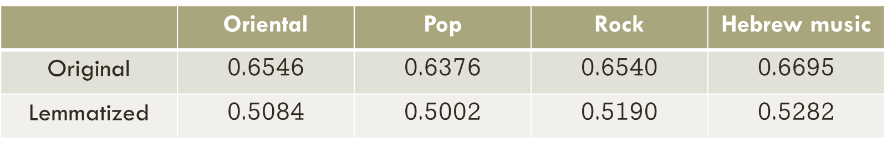

Results on lematized data:
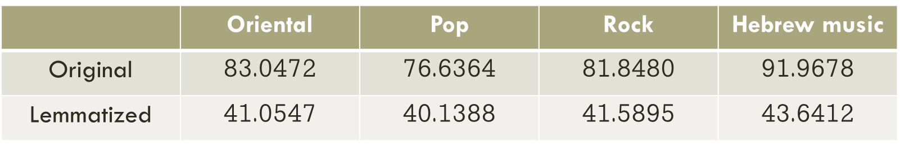

**Observations**:
1. TTR averages are almost identical for all genres both for the original data and the lemmatized data.

2. As expected, Lemmatized data →  less vocabulary diversity → less lexical diversity.

3. For MTLD, in the non-lemmatized data, Hebrew music is significantly more lexically diverse than the other genres, with pop being significantly less diverse.

4. For MTLD, in the lemmatized data, averages are almost identical for all genres.

**Methods Limitations:**:
- Songs often contain repeated phrases, choruses, and a limited vocabulary, which can negatively affect the results of both TTR and MTLD.
- The lyrical structure and poetic nature of songs differ significantly from other text types, making these measures less reliable for song data.
- Do not work well for texts ≤ 100 words.

### 2. Topic Modeling

Topic modeling was used to identify if certain topics are more significant in one of the genres. This step helps to understand the thematic content of the songs and its relationship with genres.

**Results:**

For non lemmatized data, topic 29, the love song topic, is the most dominant topic in all genres except Hebrew music. With the highest representation in oriental music:

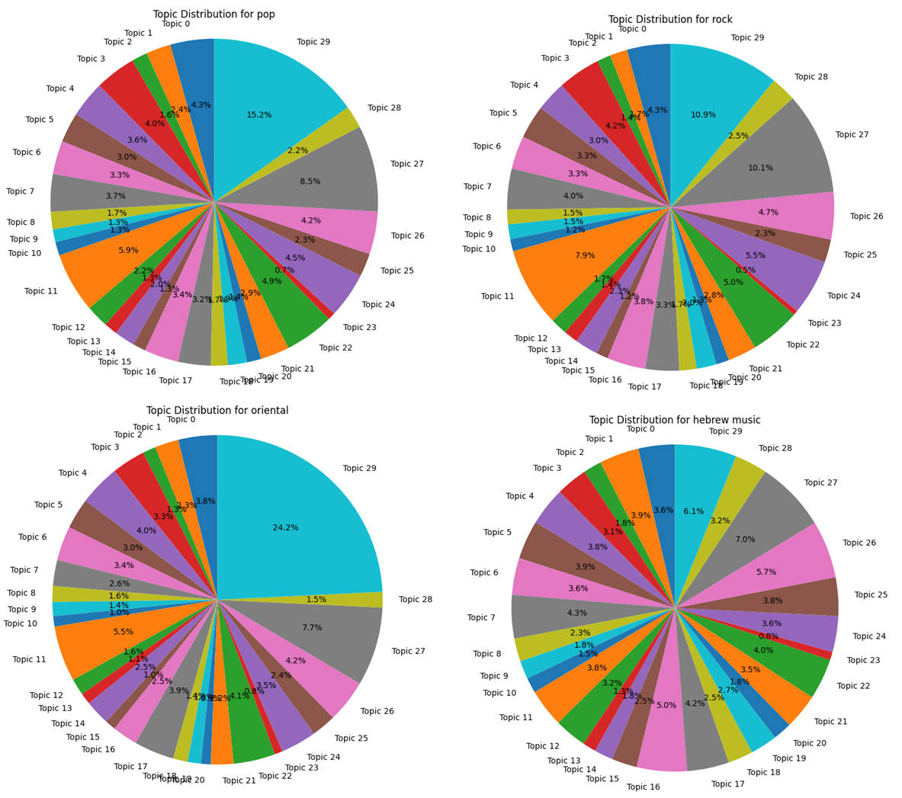

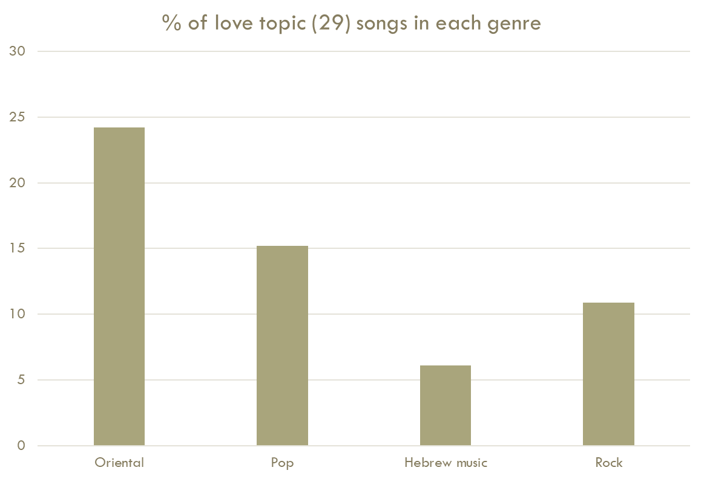

For Lemmatized data, topic 23, the sad song topic, is the a very dominant topic in all genres except Hebrew music. In addition, topic 21, the emotional song topic, is the most dominant topic in oriental music (and only in this genre):

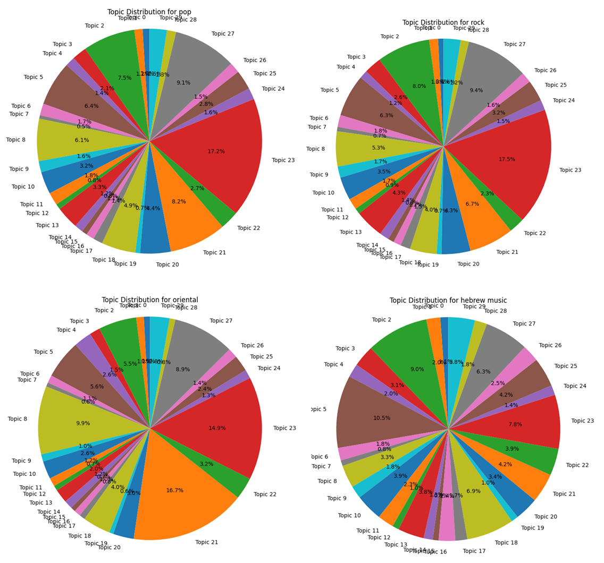

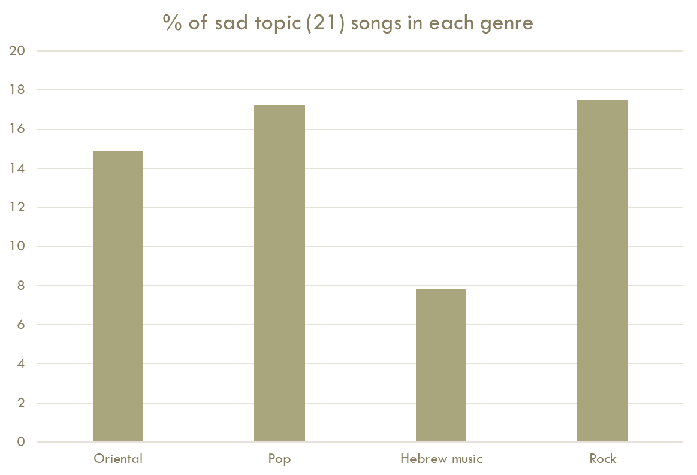

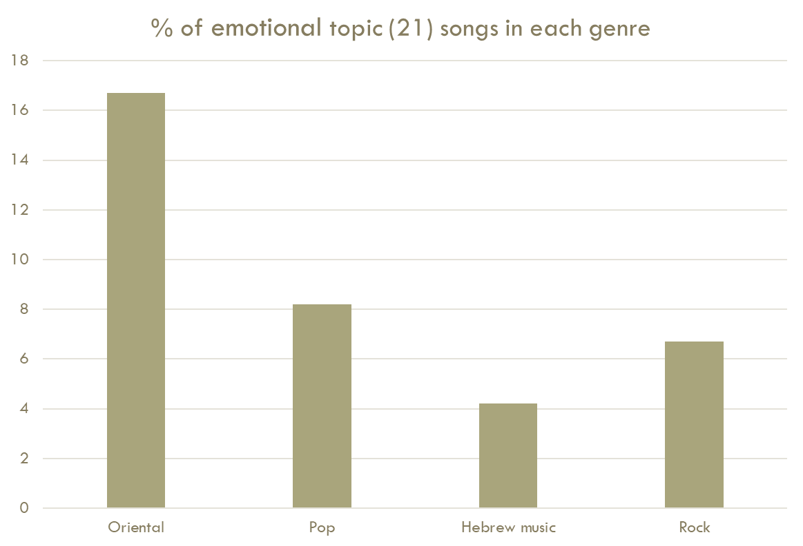

**Observations:**
- In the Hebrew music genre, songs are more spread out across topics.
- While in both pop and rock genres, a dominant song topic exists, oriental music songs tend to be more centered around 1-3 main topics.

### 3. Text Embeddings Extrcation and Visualization

AlephBERT was used for text embeddings extraction.
These embeddings capture the semantic meaning of the lyrics and were used for further analysis.

**Dimensionality Reduction**

To visualize the embeddings, **t-SNE (t-Distributed Stochastic Neighbor Embedding)** was used for dimensionality reduction. This technique helps in displaying high-dimensional data in a 2D or 3D space, making it easier to observe patterns and clusters.

**Visualization**

- **Overall Visualization**: Initially, the embeddings of all four genres were visualized together. However, the visualization did not show clear separation among the genres:

(lemmatized data on the left, non-lemmatized on the right)
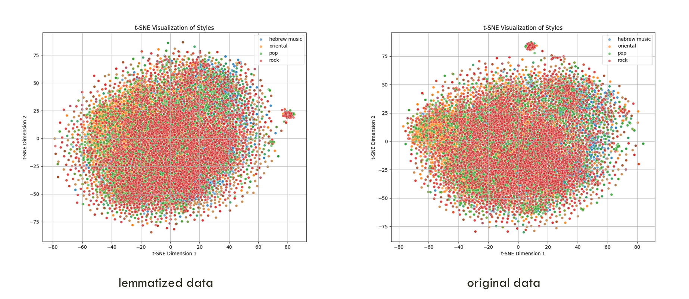

- **Pairwise Comparison**: To get a clearer view, each pair of genres was compared separately. This allowed for better visualization and understanding of the clustering behavior of the embeddings:

**Hebrew music vs Pop**

(lemmatized data on the left, non-lemmatized on the right)
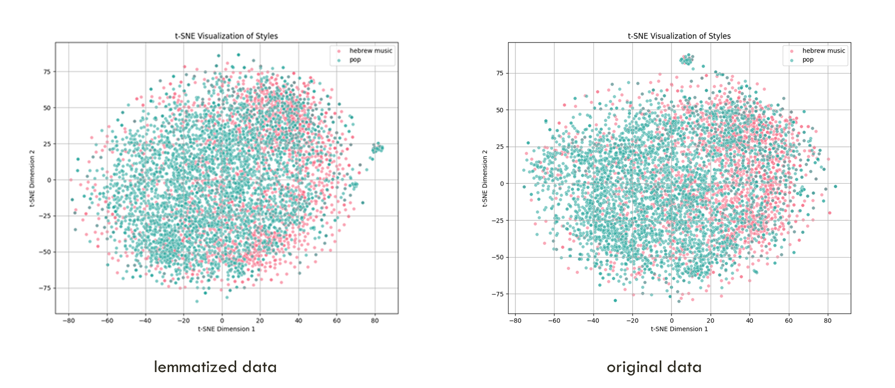

**Hebrew music vs Rock**

(lemmatized data on the left, non-lemmatized on the right)
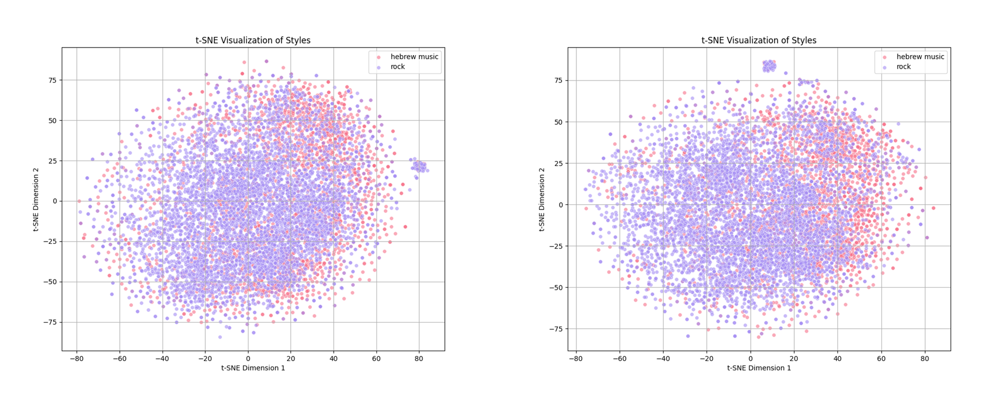

**Oriental vs Pop**

(lemmatized data on the left, non-lemmatized on the right)
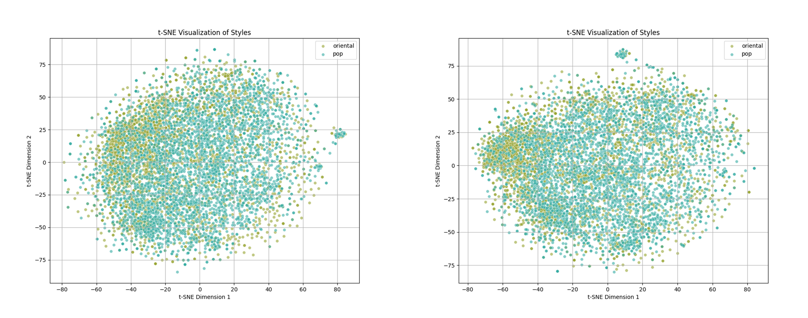

**Oriental vs Rock**

(lemmatized data on the left, non-lemmatized on the right)
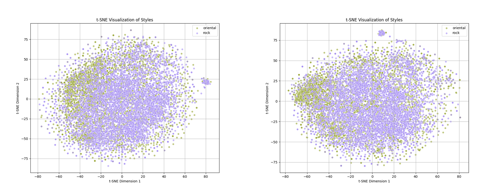

**Pop vs Rock**

(lemmatized data on the left, non-lemmatized on the right)
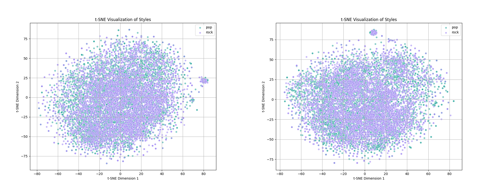

**Hebrew music vs Oriental**

(lemmatized data on the left, non-lemmatized on the right)
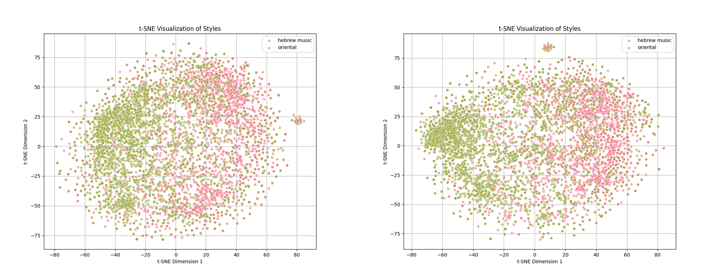

**Observations:**

- No obvious clusters except for Hebrew music and Oriental genres.
- Lemmatized data points vary less than the original data points. This is expected considering lemmatization reduces the vocabulary size, thus the data variation.

### 4. Genre Prediction

The text embeddings were utilized to predict the genre of each song. This step helps in understanding how well the embeddings represent the genre-specific characteristics of the songs.

This was done with the hypothesis of music styles that are easier to predict may be easier to distinguish from other styles thus may be more unique.

A logistic regression model was trained using the text embedding with the aim of predicting the text embedding genre:

**Results:**

(lemmatized data on the left, non-lemmatized on the right)
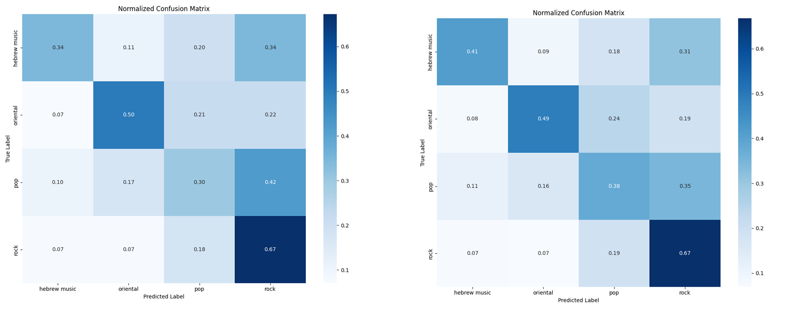

**Observations:**
- Rock is the most correctly predicted genre (most likely to be incorrectly labeled as pop).
- Pop is the least correctly predicted genre (most likely to be incorrectly labeled as rock).
- Oriental music is the 2nd most correctly predicted genre (most likely to be incorrectly labeled as pop/rock).
- Lemmatization mostly affects the genre prediction of pop and Hebrew music – causing their relative prediction to be ~20% less accurate. 

### 5. Author Identification

For each genre, six significant artists were chosen. For each artist, 111 random songs were selected. Author identification was then performed to see if the text embeddings and other features can accurately attribute songs to their respective artists.

High author identification rate can be a result of:
1. A distinct style from the rest of the genre authors.
2. All authors song being very similar, thus easy to identify.

**Results:**

Non-lemmatized data:
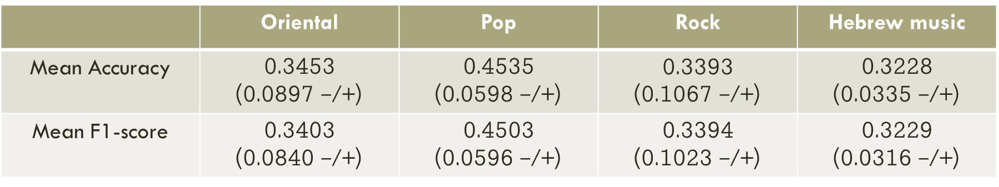

Lemmatized data:
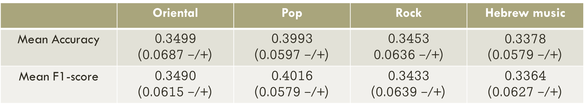

**Observations:**
- Best results on pop genre.
- The rest of the genres (including oriental) have similar results to one another.
- Biggest affect of lemmatization is on pop genre (reducing relative identification rate by ~15%).

## Observation Summary

- TTR showed very similar results for all genres on both lemmatized and non lemmatized data (with a slight lexical diversity advantage to Hebrew music genre).
- MTLD showed very showed very similar results for all genres on lemmatized data. For non lemmatized data, Hebrew music was found as the most lexically diverse, while pop was found as the least one.
- Topic modeling showed that oriental music is the genre that is most focused on specific topics, while Hebrew music was the most spread-out genre across topics.
- Text embeddings visualization showed most distinct clustering of Hebrew music and oriental genres.
- Genre prediction showed rock as the most accurately predicted genre, followed by oriental music genre. Pop being the least accurately predicted.
- Author identification showed highest accuracy on pop genre.

## Conclusion

The project provides insights into the lexical diversity of Hebrew songs across different genres. By combining various methods such as text embeddings, lexical diversity measures, topic modeling, and author identification, the project explores the distinct characteristics of oriental songs and other genres.

- In total, the experiments made do not show a genre that is significantly stylistically different or better from other genres over all methods used.
- Lexical diversity analyses and topic modeling showed best results (indicating lexical richness) on Hebrew music genre.
- MTLD, Genre Prediction and Author Identification results indicate it as being the least lexically rich genre.

## Project Limitations

- Song genres were tagged per artist and not per song, thus making the results less accurate.
- Some songs are influenced by several genres making analyses task difficult.
- Lexical richness can be affected by the era the song was created in and not by the genre it belongs to.

